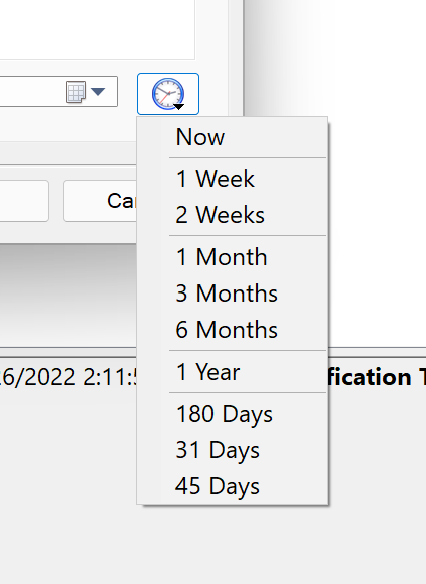
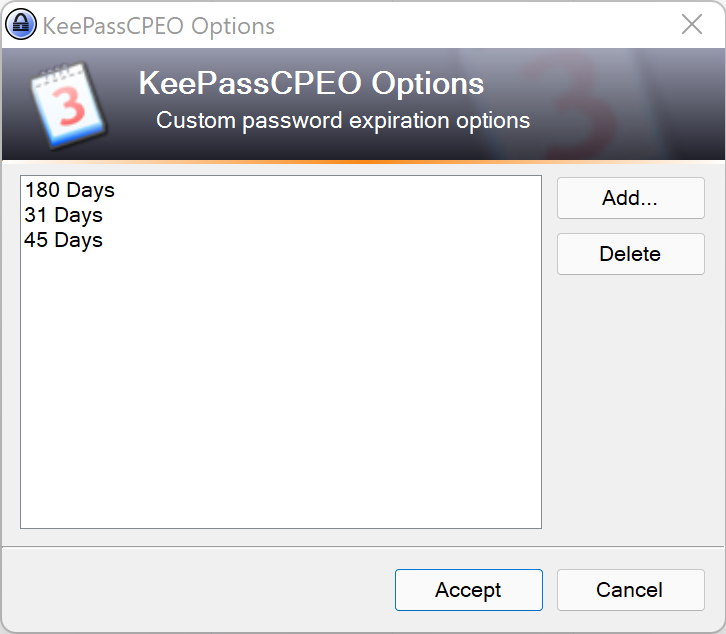
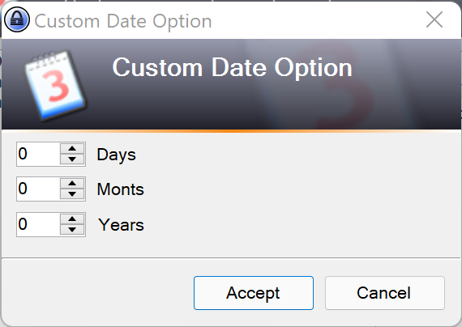
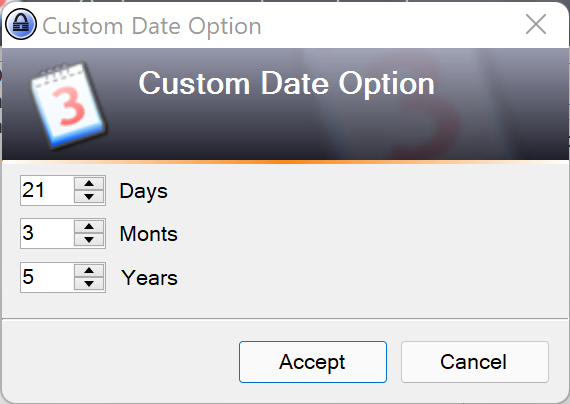
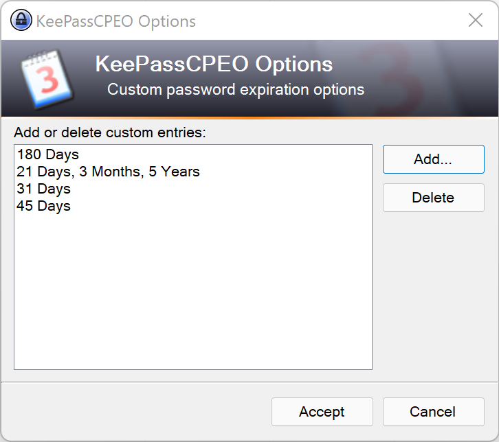
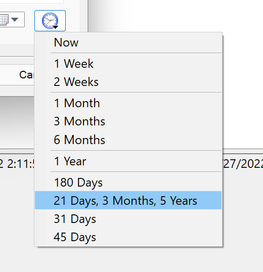
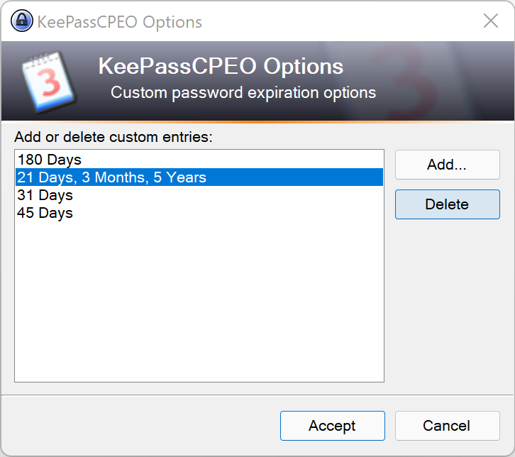
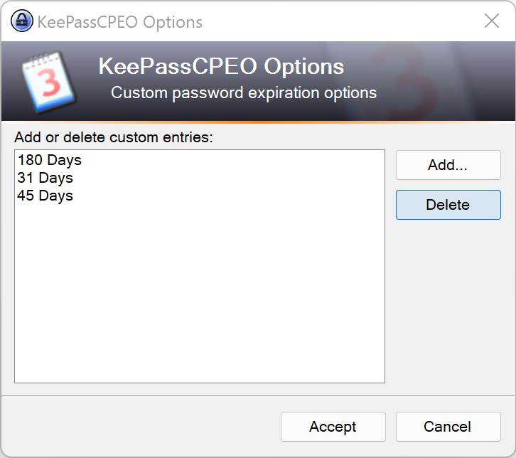

# KeePassCPEO
A plugin for KeePass to allow adding custom entries to the password expiration dropdown.

## Features
 * Allow the user to add custom entries to the password expiration dropdown.
 * Allow the user to select a custom password expiration option from the dropdown.

## System Requirements
 * KeePass 2.50 or higher.

## Getting Started
 1. Download latest release from [https://github.com/Mascavidrio/KeePassCPEO/releases](https://github.com/Mascavidrio/KeePassCPEO/releases).
 2. Copy plgx directly into the Plugins directory under the KeePass directory.
 3. Start KeePass.

## Using KeePassCPEO

By default KeePass comes with built in password expiration options for 1 Week, 2 Weeks, 1 Month, 3 Months, 6 Months, and 1 Year.

When installed, KeePassCPEO will add new sample options for 31 Days, 45 Days, and 180 Days.  

To create additional entries:

 1. Click on Tools > KeePassCPEO Options... to bring up the KeePassCPEO Options dialog.

 2. Click on Add to create a new custom expiration option.

 3. Specify the number of days, months and years for the custom expiration option.

 4. Click Accept to add the new option.

 5. Click Accept to save the new list of options.

To use a custom entry simply open a password entry and click on the password expiration times button. Select the entry from the dropdown.

To delete an entry:

1. Go to Tools > KeePassCPEO Options, then select the entry from the list.

2. Click Delete.

 
3. Click Accept to save the new list of options.

## Troubleshooting

In case entries are corrupted or some other reason, KeePassCPEO saves settings to the local computer. The settings file can be found at %appdata%\Roaming\KeePassCPEO\KeePassCPEO.Config.xml.
